# Car Sales Price Prediction Engine
## Overview

### Topic and Description
_Car Sales Price Prediction Engine_ is a web application that will help a fictional car sales company set prices for the used vehicles they have acquired and wish to sell. The web application uses machine learning and a predictive algorithm to estimate the sales price of a given car based on the mileage. This includes descriptive methods (graphs) to help the client understand the data and a predictive method (a linear regression graph) to help them make educated price-setting decisions.

### Project Purpose/Goals
The goal of this project and application is to decrease the time employees spend manually estimating appropriate prices, and, ultimately, help the company increase revenue. Historically, this fictional company has struggled to set appropriate prices for the cars they sell, leading to a loss in revenue. This project will help them to understand the market value of the cars they acquire so they can set appropriate prices to maximize their profit.

### Descriptive Methods
The project has the following three descriptive methods (graphs):
1. A scatter plot comparing the mileage to the sales price of each car.
2. A bar graph that shows the number of cars sold at various price ranges.
3. A pie chart showing the percent of cars sold at the price ranges used in the bar graph

### Predictive/Prescriptive Method
The project has one prescriptive method, which is a scatter plot with a regression line. This regression line will be generated using machine learning and is what helps the employees determine the estimate
for the sales price based on the mileage.

## Environment & Architecture
This project is a web application written with the following technologies:
 
* JavaScript/TypeScript
* Node.js v16.13.2 LTS
* [TensorFlow.js](https://www.tensorflow.org/js) (_Node.js libr /ary used for machine learning_)
* [React.js](https://reactjs.org/) (_JavaScript libr /ary for building user interfaces_)
* [Next.js](https://nextjs.org/) (_Full-stack React.js framework_)
* [Tailwind CSS](https://tailwindcss.com/) (_Utility-first CSS framework_)
* [Chart.js](https://www.chartjs.org/) (JavaScript charting libr /ary)

The environment used and target platform for this application is Microsoft Windows.

## Prerequisites
Before you can install and run the web application, you must first install the following:

* Node.js 16
* [Yarn 1](https://yarnpkg.com/)

### Install Node.js 16
Download Node.js 16 LTS installer from this website: https://nodejs.org/en/

Once installed, confirm that the correct version of Node is installed by running the following command in a terminal/command prompt window:

```
node --version
```

### Install Yarn 1
After verifying that Node.js 16 is installed correctly, run the following command to install Yarn:

```bash
npm install --global yarn
```

Verify that the correct version of Yarn is installed by running the following command:

```
yarn --version
```


## Installation & Application Launch

### Clone Repository
After verifying that Node.js and Yarn are installed, you are ready to install the application. In a terminal window, navigate to a folder where you'd like to install the application and clone this repository:

```bash
git clone https://github.com/Joebr /adyDev/jb-capstone.git
```

### Install Application
Once the repository is cloned, using a terminal window, navigate to the directory where the application was downloaded:

```bash
cd jb-capstone
```

In the application root directory, install the application's dependencies using yarn, using this command:

```bash
yarn install
```

### Launch Application
Once dependencies have been installed, you are ready to run the application. Run the following command to launch the application server:

```bash
yarn dev
```

**Known Bug**: Note that you **cannot** use _"yarn start"_ or _"npm start"_ to start the application. This will result in the charts not loading, so you must use the _"yarn dev"_ command as mentioned above.

### Open Application
After the server has been started, you can use a br /owser navigate to the following location and view the application:

http://localhost:3000


## Application Usage

### Logging In and Logging Out

#### How to Sign In
After starting the server and navigating to http://localhost:3000, you will be brought a login page. Please enter the following credentials to log into the application:

* _Username_: "john.doe"
* _Password_: "wgu1234$"

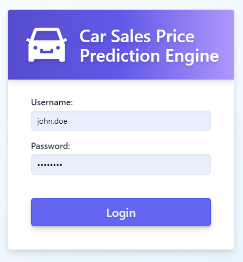

<br />

#### How to Sign Out

If you need to log out of the application, you can click the "Logout" button at the top right of the screen. Note that you will also be automatically logged out after an hour of inactivity.

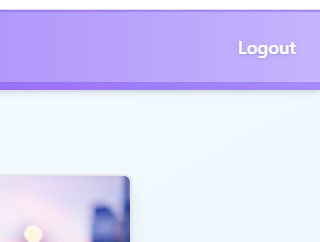

<br />


### Dashboard
When you log in, you are immediately brought to the _Dashboard_ page. This has a welcome message and a description of each page of the application.

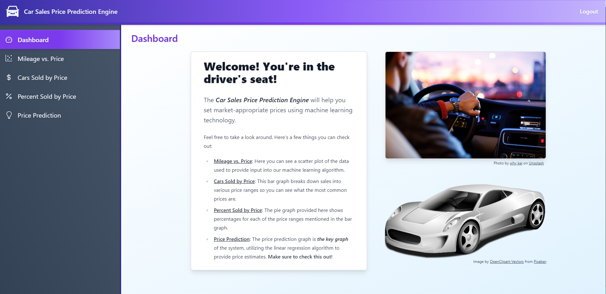

<br />

### Sidebar Navigation
On the left side of the screen there is a sidebar with links you can use to navigate to each page of the application.

The sidebar contains the following items:

* Dashboard (_Descriptions of/links to each page_)
* Mileage vs. Price (_Scatter plot of the data_)
* Cars Sold by Price (_Bar graph of cars sold by price_)
* Percent Sold by Price (_Pie chart of cars sold by price_)
* Price Prediction (_Regression line chart/scatter plot_)

<br />

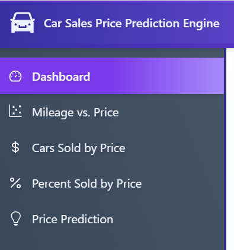

<br />

### Chart Pages
After clicking any of the chart pages other than the _Dashboard_, you are brought to each respective chart page. _Note that, at this point, the chart is not loaded._

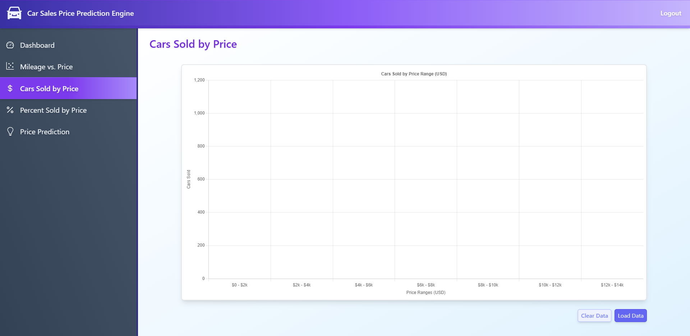

<br />

### Chart Actions
#### Default Chart Actions
For each of the charts, there are a default set of chart actions (at the bottom right of each chart), which include:

* Clear Data (_Removes data from the chart_)
* Load Data (_Loads relevant data into the chart_)

<br />

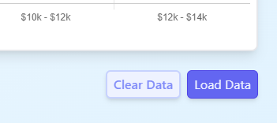

<br />

After clicking the "Load Data" button, each chart will be filled with data. _Note that each chart is color-coded and labeled with the appropriate data._


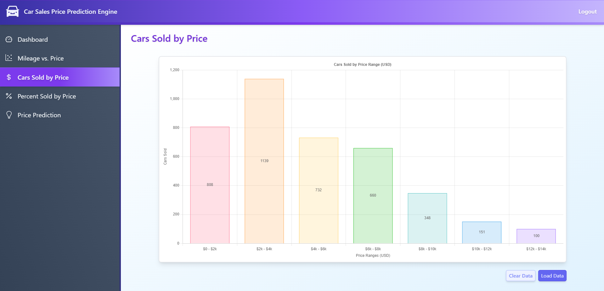

<br />

#### Price Prediction Chart Action
For the "Price Prediction" chart, there is one additional action:

* Run Prediction (_Runs the machine learning algorithm and loads into chart_)
    
    _Note that the machine learning algorithm takes some time to run._

<br />

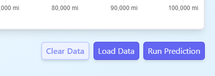

<br />

### Selectable Price Ranges
The "Percent Sold by Price" pie chart has a bonus feature that allows the user to select price ranges and recalculate the percentages in real time.


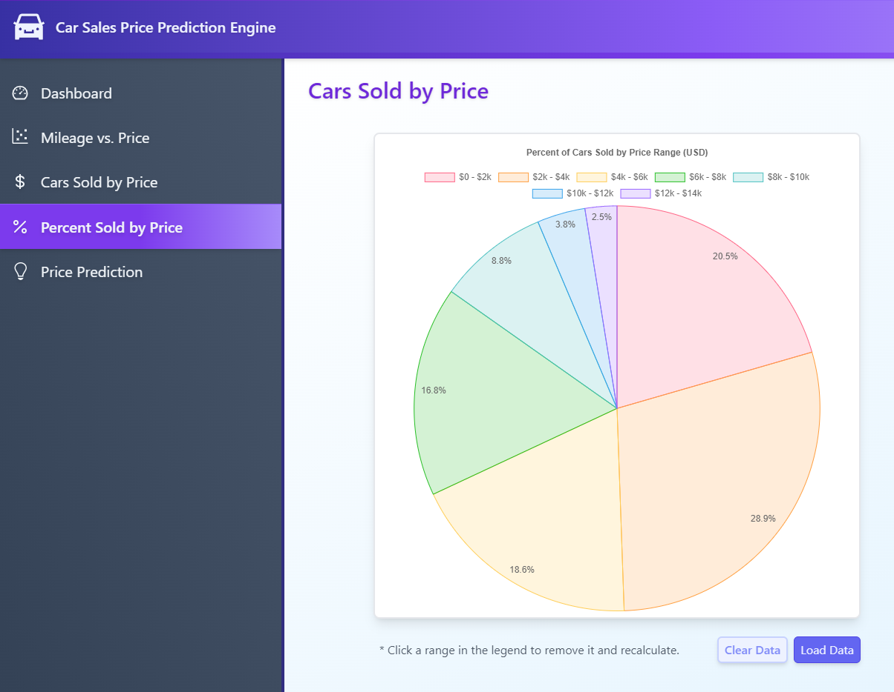

<br />


Price ranges are selected by clicking them in the legend at the top of the pie chart. These will cross each price range off the legend and remove it from the chart. To add the price range back, simply click the crossed off item and it will become uncrossed and reappear in the chart.

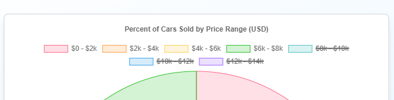

<br />

This is how the chart looks when the user selects to only look at cars sold with a price range between $0 and $8,000.

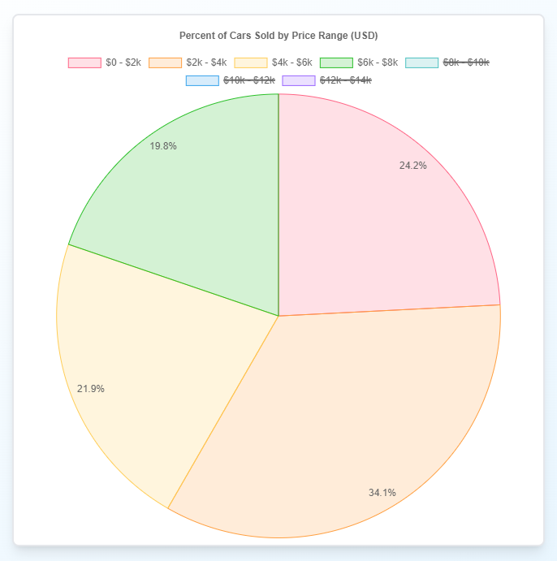

<br />

### Scatter Plot Tooltips
The "Mileage vs. Price" and "Price Prediction" scatter plot charts show tooltips when you hover over each data point. 

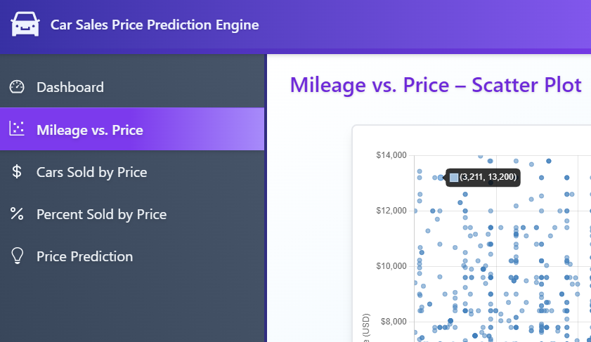

<br />

If there are multiple data points of cars at the same mileage and price, these are repeated in the tooltip

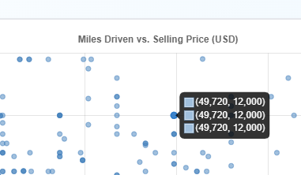

<br />

### Hideable Data Points/Regression Line
For the "Price Prediction" chart, the user can toggle whether to display the data points or the regression line.

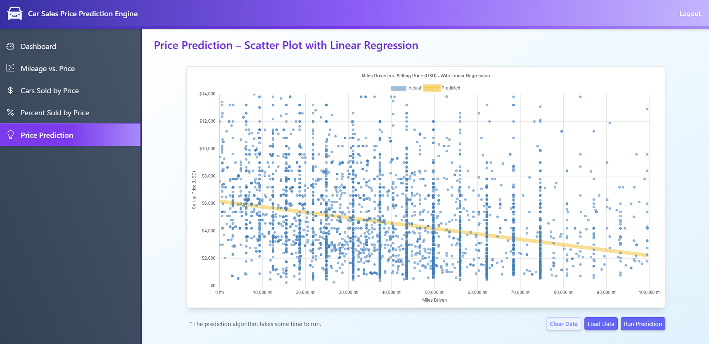

<br />

This is done by clicking the "Actual" and "Predicted" items in the legend. Clicking the item in the legend once will check it off and remove the regression or data points from the chart. Clicking again will bring them back.

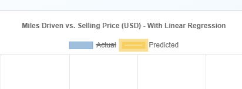

This is how the "Price Prediction" chart looks when the "Actual" data points have been hidden.

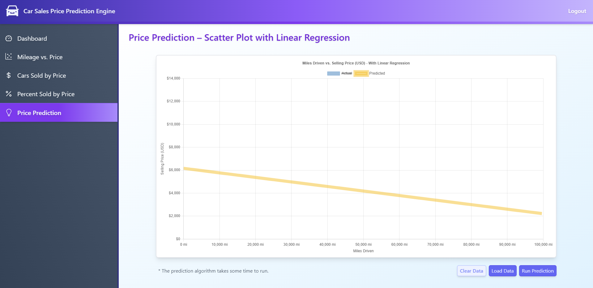